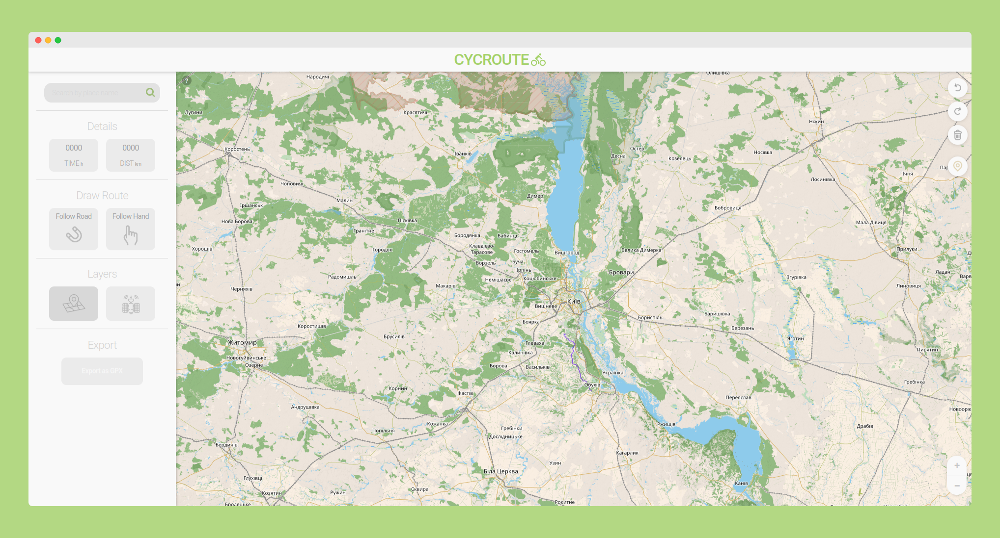

CYCROUTE - website to create bike routes and export them in GPX/KML format.

## Features

- Search location (geocoder)
- Change map styles
- Change route draw styles
- Undo, Redo, Clear All, Find location
- Export GPX/KML
- Change route color

## TO-DO

- ~~Migrate project to TypeScript~~;
- ~~Add start page~~;
- ~~Implement route color changing~~;
- ~~Add KML export~~;
- Save session after restart;
- Add route editing by dragging a waypoint;
- ~~Add keyboard shortcuts ~~;

## Tech

- [React]
- [Vite]
- [React Redux, Toolkit]
- [Leaflet]

Live Demo - https://cycroute.netlify.app/

